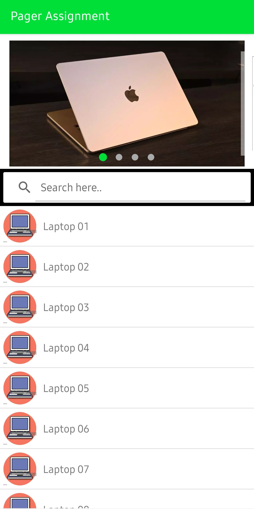
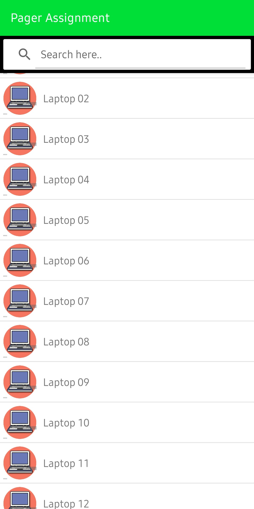
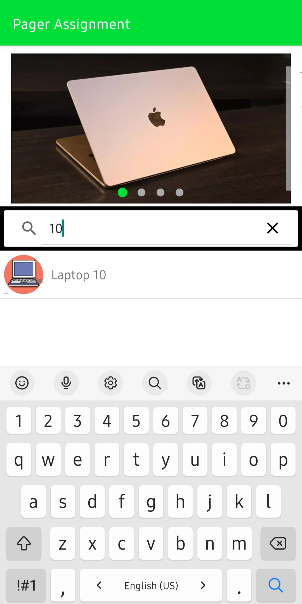
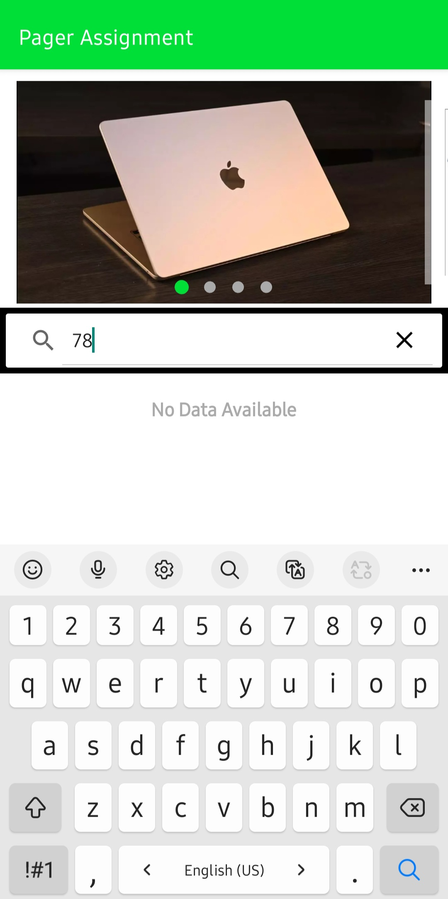

# Ila Bank Pager Sample
--------------
Simple Android Application to demonstrate View Pager and Recyclerview by using MVVM with Repository pattern and Dependency Injection.

# Screenshots
--------------

# Concepts Used
--------------
* MVVM Architecture
* Data & View Binding
* Coroutine, Flow & Scope
* Repository Pattern for code separations
* Dependency Injection (Hilt)
* Used Data and Sealed Classes
* StateFlow and MutableStateFlow
* Scope Function